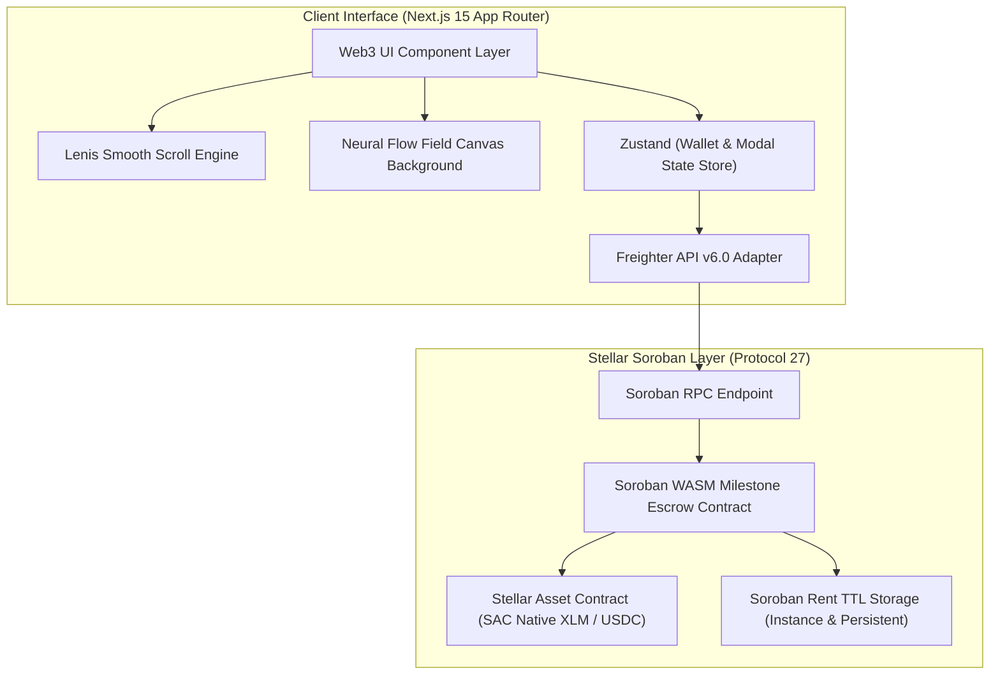

# Veris — Soroban Milestone Settlement Platform

[](https://stellar.expert/explorer/testnet/contract/CB6A4VZYMV3IOT4JNYA26XWX2UBR2LISJQOTHI3Z5Y3FVQMSZDXEQJXT)
[](https://soroban.stellar.org)
[](https://nextjs.org)
[](https://vitest.dev)
[](https://github.com/akshat3410/Veris/actions)

**Veris** is a non-custodial, milestone-driven escrow and settlement engine built on **Stellar** and **Soroban WASM smart contracts**. It enables clients and contractors to engage in trustless digital escrow agreements where funds are locked on-chain in smart contract custody and released in sequential tranches upon deliverable verification and authorization.

---

## 🔗 On-Chain Verification & Deployment Details

| Parameter | Details | Link |
| :--- | :--- | :--- |
| **Network** | Stellar Testnet (`Test SDF Network ; September 2015`) | [Stellar Network Status](https://status.stellar.org) |
| **Smart Contract ID** | `CB6A4VZYMV3IOT4JNYA26XWX2UBR2LISJQOTHI3Z5Y3FVQMSZDXEQJXT` | [View Contract on Stellar Expert](https://stellar.expert/explorer/testnet/contract/CB6A4VZYMV3IOT4JNYA26XWX2UBR2LISJQOTHI3Z5Y3FVQMSZDXEQJXT) |
| **Native SAC Token ID** | `CDLZFC3SYJYDZT7K67VZ75HPJVIEUVNIXF47ZG2FB2RMQQVU2HHGCYSC` | [View Token on Stellar Expert](https://stellar.expert/explorer/testnet/contract/CDLZFC3SYJYDZT7K67VZ75HPJVIEUVNIXF47ZG2FB2RMQQVU2HHGCYSC) |
| **Contract Initialization Tx** | `edae73258c981063cf7f01e7f6fbe15fc7ae05cd3ceb6e5be54026ee1fc17889` | [View Transaction on Stellar Expert](https://stellar.expert/explorer/testnet/tx/edae73258c981063cf7f01e7f6fbe15fc7ae05cd3ceb6e5be54026ee1fc17889) |
| **RPC Endpoint** | `https://soroban-testnet.stellar.org` | [Soroban Testnet RPC](https://soroban-testnet.stellar.org) |

---

## ⚡ Key Features & Highlights

- 🔒 **Non-Custodial Smart Contract Custody**: Capital is locked directly in WASM contract instance storage. Zero intermediary key handling.
- 🎯 **Milestone Tranche Settlement**: Contracts are partitioned into deliverable milestones. Payouts execute upon client approval in ~3.2s finality.
- ⚡ **HTML5 Flow Field & Inertia Scroll**: Built with responsive canvas particle repulsion physics and `Lenis` smooth inertia scrolling.
- 💎 **Minimalist Obsidian & Electric Violet Palette**: Engineered using a 60% Deep Obsidian (`#09090B`), 30% Electric Purple (`#A855F7`), and 10% Gold Accent (`#FACC15`) design system.
- 📑 **IPFS Cryptographic Proof**: Contractors submit deliverable proof CIDs directly onto the Stellar ledger.
- ⚖️ **Arbiter Dispute Resolution**: Integrated 3rd-party arbitration role with custom split payouts for contested engagements.
- 🧪 **Automated Testing Suite**: Fully tested state store, calculations, and contract formatting (`11/11 tests passed`).
- 🚀 **Continuous Integration (CI/CD)**: Automated GitHub Actions pipeline verifying TypeScript compilation, unit tests, and production build on every push.

---

## 🏗 System Architecture



---

## 🛠 Tech Stack & Dependencies

| Layer | Technologies |
| :--- | :--- |
| **Frontend Framework** | Next.js 15 (App Router), React 18, TypeScript 5.x |
| **Styling & Icons** | Tailwind CSS, `@phosphor-icons/react`, Google Fonts (`Chakra Petch`, `Space Grotesk`) |
| **Motion & Scroll** | `Lenis` Inertia Scroll, HTML5 2D Canvas Flow Field Physics |
| **State Management** | TanStack Query v5 (RPC Polling), Zustand v4 (Wallet & UI Store) |
| **Smart Contracts** | Rust, `soroban-sdk` v22.0.0 (`wasm32-unknown-unknown`) |
| **Blockchain Client** | `@stellar/stellar-sdk` v16.1.0, `@stellar/freighter-api` v6.0.1 |
| **Testing Suite** | Vitest v4.1 (11 Automated Unit Tests) |
| **CI/CD** | GitHub Actions Workflow (`.github/workflows/ci.yml`) |

---

## 📂 Repository Layout

```
├── /app                             # Next.js 15 App Router pages & styles
│   ├── layout.tsx                   # Root layout wrapped in SmoothScrollProvider
│   ├── page.tsx                     # Main landing page & escrow engine dashboard
│   ├── globals.css                  # 60-30-10 CSS variables & typography tokens
│   └── /api/webhook                 # Transaction verification webhook endpoint
├── /components
│   ├── /common                      # Navbar, TxModal, Footer
│   ├── /dashboard                   # StatsCards, EscrowList, EventsFeed
│   ├── /modals                      # ConnectWallet, CreateEscrow, SubmitWork, Dispute, ResolveDispute
│   ├── /providers                   # SmoothScrollProvider, ReactQueryProvider
│   └── /ui                          # NeuralBackground flow field canvas
├── /contracts                       # Soroban Rust WASM Smart Contracts
│   └── /milestone_escrow
│       ├── /src (lib.rs, types.rs, storage.rs, errors.rs, events.rs, test.rs)
│       └── Cargo.toml
├── /hooks                           # Custom hooks (useWallet, useEscrows, useEscrowContract)
├── /lib                             # Stellar RPC client, utils, & wallet initializers
├── /__tests__                       # Vitest unit test suite (wallet.test.ts, escrow.test.ts)
├── .github/workflows/ci.yml         # Automated GitHub Actions CI workflow
├── vitest.config.ts                 # Vitest test runner configuration
├── next.config.js                   # Next.js bundler configuration
└── package.json
```

---

## 🚀 Quick Start & Local Setup

### 1. Clone & Install
```bash
git clone https://github.com/akshat3410/Veris.git
cd Veris

npm install
```

### 2. Run Automated Unit Tests (11 Passing Tests)
```bash
npm run test
```

Expected Output:
```
 ✓ __tests__/wallet.test.ts (4 tests)
 ✓ __tests__/escrow.test.ts (7 tests)

 Test Files  2 passed (2)
      Tests  11 passed (11)
```

### 3. Start Development Server
```bash
npm run dev
```
Open `http://localhost:3000` in your browser.

### 4. Build Production Bundle
```bash
npm run build
```

---

## 📜 Soroban Smart Contract Deployment

To build and deploy the smart contract WASM binary to Stellar Testnet:

```bash
cd contracts/milestone_escrow

# 1. Compile WASM binary
cargo build --target wasm32-unknown-unknown --release

# 2. Deploy to Stellar Testnet
stellar contract deploy \
  --wasm target/wasm32-unknown-unknown/release/milestone_escrow.wasm \
  --source deployer \
  --network testnet

# 3. Initialize Contract
stellar contract invoke \
  --id CB6A4VZYMV3IOT4JNYA26XWX2UBR2LISJQOTHI3Z5Y3FVQMSZDXEQJXT \
  --source deployer \
  --network testnet \
  -- initialize \
  --admin <ADMIN_ADDRESS>
```

---

## 🔐 Security & Reliability Safeguards

1. **Explicit Authorization**: Every state mutation mandates `require_auth()` from designated depositor, beneficiary, or arbiter.
2. **Reentrancy Protection**: Token transfers occur synchronously with strict state updates.
3. **Automated Rent TTL Extension**: Extends Soroban storage TTL on every interaction (`INSTANCE_BUMP_AMOUNT`, `PERSISTENT_BUMP_AMOUNT`).
4. **Hydration & Bounds Guard**: All Canvas and Window APIs are guarded against SSR hydration mismatches.
5. **Deduplicated Query Engine**: On-chain RPC responses are strictly deduplicated to ensure unique React rendering states.

---

## 📄 License

Distributed under the MIT License. See `LICENSE` for details.
