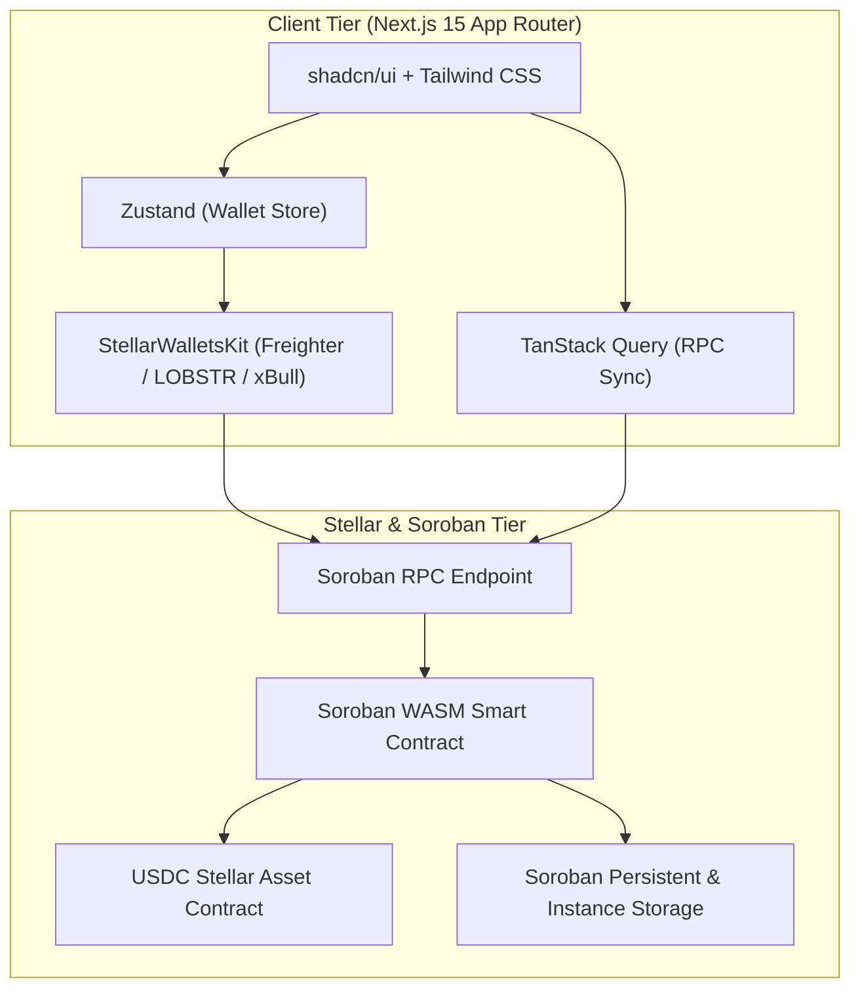

# Stellar EscrowVault — Soroban Milestone Escrow Platform

[](https://stellar.org)
[](https://soroban.stellar.org)
[](https://nextjs.org)
[](https://www.typescriptlang.org)

Production-grade decentralized application for milestone-based USDC payments, deliverables verification, and multi-party dispute resolution built on **Stellar** and **Soroban WASM smart contracts**.

---

## 🌟 Key Features

- **Trustless USDC Custody**: Lock funds in immutable Soroban WASM smart contract state. No centralized platform intermediary.
- **Milestone-Based Payouts**: Break projects into granular deliverable milestones. Funds release automatically upon client approval.
- **IPFS Proof Submission**: Contractors submit deliverable proof CIDs directly on-chain.
- **Multi-Party Arbitration**: Arbiter role can resolve disputes with custom split ratios between client and contractor.
- **Soroban State Rent & TTL Optimizations**: Automated `extend_ttl` storage management for Instance and Persistent contract entries.
- **Real-Time Telemetry Stream**: Live contract event parsing and automated TanStack Query polling every 5 seconds.
- **Multi-Wallet Support**: Integrated `@creamtastic/stellar-wallets-kit` and Freighter API.

---

## 🏗️ Architecture



---

## 🛠️ Tech Stack

- **Frontend**: Next.js 15 (App Router), TypeScript 5.x, Tailwind CSS, `shadcn/ui`, Framer Motion
- **State Management**: TanStack Query v5 (RPC state/caching/polling), Zustand (wallet/UI state)
- **Smart Contracts**: Rust, `soroban-sdk` v22.0.0, WASM target `wasm32-unknown-unknown`
- **Stellar Integration**: `@stellar/stellar-sdk` v13.0.0, `@creamtastic/stellar-wallets-kit`, `@stellar/freighter-api`

---

## 📂 Project Structure

```
/milestone-escrow-platform
├── /app                             # Next.js 15 App Router pages & layout
│   ├── layout.tsx                   # Root layout with QueryProvider & Navbar
│   ├── page.tsx                     # Main dashboard & hero view
│   └── globals.css                  # Custom Tailwind glassmorphic design system
├── /components
│   ├── /common                      # Navbar, Footer, TxModal
│   ├── /dashboard                   # StatsCards, EscrowList, EventsFeed
│   ├── /modals                      # ConnectWallet, CreateEscrow, SubmitWork, Dispute, ResolveDispute
│   ├── /providers                   # ReactQueryProvider
│   └── /visuals                     # GlowingOrb, GlassContainers
├── /contracts                       # Soroban Smart Contract Workspace
│   └── /milestone_escrow
│       ├── /src
│       │   ├── lib.rs               # Main smart contract entrypoint
│       │   ├── types.rs             # Structs, Enums, DataKey layout
│       │   ├── errors.rs            # Custom EscrowError codes
│       │   ├── storage.rs           # Rent TTL extension & storage getters
│       │   ├── events.rs            # Soroban event publishers
│       │   └── test.rs              # Soroban test suite
│       └── Cargo.toml               # Rust dependencies
├── /hooks                           # React hooks
│   ├── useWallet.ts                 # Wallet state hook
│   ├── useEscrows.ts                # TanStack Query RPC hook
│   ├── useEscrowContract.ts         # Transaction simulation & submission pipeline
│   └── useSorobanEvents.ts          # Event telemetry stream hook
├── /lib
│   ├── /contracts/config.ts         # Contract address & Soroban network config
│   ├── /stellar/client.ts           # Soroban RPC client & XDR parsers
│   ├── /wallet/kit.ts               # Wallet kit configuration
│   └── utils.ts                     # Amount formatting & address truncation
├── /scripts
│   └── deploy_contract.sh           # Automated Soroban Testnet deployment script
├── package.json
└── README.md
```

---

## 🚀 Running Locally

### Prerequisites
- Node.js >= 18.x
- npm / yarn / pnpm

### Setup Steps
```bash
# 1. Clone repository
git clone https://github.com/akshat3410/arclab-landing-page.git
cd milestone-escrow-platform

# 2. Install dependencies
npm install

# 3. Build & Deploy Smart Contract (Optional if using default Testnet config)
./scripts/deploy_contract.sh

# 4. Start Development Server
npm run dev
```

Open [http://localhost:3000](http://localhost:3000) in your browser.

---

## 📜 Contract Deployment & Verification

To build and deploy the WASM smart contract manually using the Stellar CLI:

```bash
cd contracts/milestone_escrow

# Build WASM binary
cargo build --target wasm32-unknown-unknown --release

# Deploy WASM to Soroban Testnet
stellar contract deploy \
  --wasm target/wasm32-unknown-unknown/release/milestone_escrow.wasm \
  --source deployer \
  --network testnet
```

- **Testnet Contract ID**: `CDLZFC3SYJYDZT7K67VZ75HPJVIEUVNIXF47ZG2FB2RMWAXA26TX27N5`
- **USDC SAC Token ID**: `CCW67TSB3SSS366OIOMAYDHUTLXDGOWMY7SC2226XM5FYW5EAKOJ62OY`

---

## 🔒 Security Considerations

- **Authorization Enforcement**: Every state mutation verifies signature via `require_auth()`.
- **Reentrancy Protection**: Token transfers occur before final state updates.
- **Rent Archival Handling**: Automatic TTL extensions on every contract access (`INSTANCE_BUMP_AMOUNT`, `PERSISTENT_BUMP_AMOUNT`).
- **No Private Keys on Client**: Client application never holds private keys. All signing delegated to wallet adapters.
