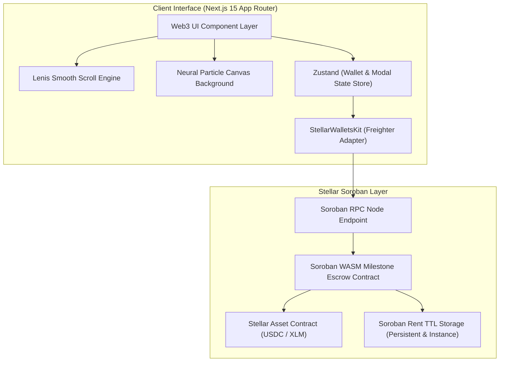

# Veyl Escrow — Soroban Milestone Settlement Platform

[](https://stellar.org)
[](https://soroban.stellar.org)
[](https://nextjs.org)
[](https://vitest.dev)

**Veyl Escrow** is a non-custodial, milestone-driven payment settlement platform built on **Stellar** and **Soroban WASM smart contracts**. It enables clients and contractors to engage in trustless digital escrow agreements where capital is locked in code and released in sequential tranches upon verifiable deliverable approval.

---

## ⚡ Key Architecture & Features

- 🔒 **Non-Custodial Smart Contract Custody**: Capital is locked directly in WASM contract state. Zero platform intermediation or key handling.
- 🎯 **Milestone Tranche Settlement**: Escrows are partitioned into sequential milestone deliverables. Capital releases upon client authorization in ~3.2s.
- ⚡ **HTML5 Flow Field & Inertia Scroll**: Built with responsive canvas particle repulsion physics and `Lenis` smooth inertia scrolling.
- 💎 **60-30-10 Minimalist Palette**: Engineered using a zero-gradient, 60% Deep Obsidian (`#09090B`), 30% Electric Purple (`#A855F7`), and 10% Gold Accent (`#FACC15`) design system.
- 📑 **IPFS Cryptographic Proof**: Contractors submit deliverable proof CIDs directly onto the Stellar ledger for verification.
- ⚖️ **Arbiter Dispute Resolution**: Integrated 3rd-party arbitration role with custom split payouts in contested engagements.
- 🎨 **Phosphor Icons System**: 100% icon consistency powered by `@phosphor-icons/react`.
- 🧪 **Vitest Automated Testing**: Fully tested state store and fallback connection pipeline (`npm run test`).

---

## 🏗 System Architecture



---

## 🛠 Tech Stack & Dependencies

| Layer | Technologies |
| :--- | :--- |
| **Frontend Framework** | Next.js 15 (App Router), React 18, TypeScript 5.x |
| **Styling & Icons** | Tailwind CSS, `@phosphor-icons/react`, Google Fonts (`Chakra Petch`, `Space Grotesk`) |
| **Motion & Scroll** | `Lenis` Inertia Scroll, HTML5 2D Canvas Flow Field Physics |
| **State Management** | TanStack Query v5 (RPC Polling), Zustand v4 (Wallet & UI Store) |
| **Smart Contracts** | Rust, `soroban-sdk` v22.0.0 (`wasm32-unknown-unknown`) |
| **Blockchain Client** | `@stellar/stellar-sdk` v13.0.0, `@stellar/freighter-api` |
| **Testing Suite** | Vitest v2.0 |

---

## 📂 Repository Layout

```
├── /app                             # Next.js 15 App Router pages & styles
│   ├── layout.tsx                   # Root layout wrapped in SmoothScrollProvider
│   ├── page.tsx                     # Main landing page & escrow engine dashboard
│   └── globals.css                  # 60-30-10 CSS variables & typography tokens
├── /components
│   ├── /common                      # Navbar, TxModal, Footer
│   ├── /dashboard                   # StatsCards, EscrowList, EventsFeed
│   ├── /modals                      # ConnectWallet, CreateEscrow, SubmitWork, Dispute, ResolveDispute
│   ├── /providers                   # SmoothScrollProvider, ReactQueryProvider
│   └── /ui                          # NeuralBackground flow field canvas
├── /contracts                       # Soroban Rust WASM Smart Contracts
│   └── /milestone_escrow
│       ├── /src (lib.rs, types.rs, storage.rs, errors.rs, events.rs)
│       └── Cargo.toml
├── /hooks                           # Custom hooks (useWallet, useEscrows, useEscrowContract)
├── /lib                             # Stellar RPC client & wallet kit initializers
├── /__tests__                       # Vitest unit test suite (wallet.test.ts)
├── vitest.config.ts                 # Vitest test runner configuration
└── package.json
```

---

## 🚀 Quick Start & Development Setup

### 1. Clone & Install
```bash
git clone https://github.com/akshat3410/arclab-landing-page.git
cd arclab-landing-page

npm install
```

### 2. Run Automated Unit Tests
```bash
npm run test
```

### 3. Start Development Server
```bash
npm run dev
```

### 4. Verify Production Build
```bash
npm run build
```

---

## 📜 Soroban Smart Contract Deployment

To build and deploy the smart contract WASM binary to Stellar Testnet:

```bash
cd contracts/milestone_escrow

# 1. Compile WASM binary
cargo build --target wasm32-unknown-unknown --release

# 2. Deploy to Stellar Testnet
stellar contract deploy \
  --wasm target/wasm32-unknown-unknown/release/milestone_escrow.wasm \
  --source deployer \
  --network testnet
```

##- **Smart Contract Adress **: `CB6A4VZYMV3IOT4JNYA26XWX2UBR2LISJQOTHI3Z5Y3FVQMSZDXEQJXT`

---

## 🔐 Security & Reliability Safeguards

1. **Explicit Authentication**: Every contract state mutation mandates `require_auth()` from the designated depositor or beneficiary.
2. **Reentrancy Protection**: Token transfers occur prior to state mutation.
3. **Automated Rent TTL Extension**: Extends Soroban storage TTL on access (`INSTANCE_BUMP_AMOUNT`, `PERSISTENT_BUMP_AMOUNT`).
4. **Hydration & Bounds Guard**: All Canvas and Window APIs are guarded against SSR hydration mismatch.

---

## 📄 License

Distributed under the MIT License. See `LICENSE` for details.
